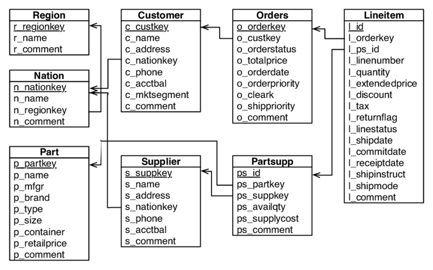

Source: https://github.com/prospa-group-oss/interview-test-data-engineer   
Country: Australia  
(apparently it's for this company https://www.prospa.com/ ?)
======================

# Data Engineer Interview Test

Prospa is looking for a high quality data engineer which can deliver comprehensive solutions for our continuity and business growth. 

The Data Engineering team drives the data culture at Prospa. We are migrating from large batches to micro batching, from daily to near real-time/streaming processing, from tabular reports to insightful dashboards.

You can be part of an amazing team which solves business problems with data via different processes, tools and technologies.

The following is a small ETL project as a technical challenge for those keen on join us.

# The Project
Build a simple ETL process to digest the provided set of files into a star schema. 

The end result should enable users to easily slice and dice the data through a report, or using basic ad-hoc queries.

### Tools and Technologies
We would like you to use Python and SQL, as these are our everyday tools.  

However, we are open to other open-sourced tools and technologies, if we are able to easily replicate on our side. 

What we need from you?
-----------------------
Clone this repo, build your ETL process and commit the code with your answers. 

Open a Pull Request and in the description state "I have completed the test."

#### Expectations
* Include a step-by-step instruction to run your code.
* We may move or delete your code after we have analysed the PR. 
* Use best practices.
* You are expected to be able to explain this whole process in a face-to-face interview.
* Allow for 4-6 hours for this test.

Instructions
--------- 

1. The data for this exercise can be found in the `data.zip` file. Please describe the file format.

**Bonus** point (hard): generate your own data as per instructions in the encoded file `bonus_etl_data_gen.txt`.
To get the bonus point, please include an encoded file of the generated data set.

2. Design a star schema model, and write the load scripts to populate the schema. Provide the loads scripts, alongside an ERD (hand-drawn is ok). 

**Bonus** point: 
- define a classification for breaking the customer account balances into 3 logical groups
- add a field for this new classification
- add revenue per line item

3. Describe how you can schedule this process to run multiple times per day.
 
**Bonus** point: 
- What would you do to cater for data arriving in random order?
- What about if the data comes from a stream, and arrives at random times?

4. Describe how you would deploy your code to production, and allow for future maitenance.

**Bonus** point: What changes would you need to make to run this code in a containerized environment (e.g. Docker)? 

5. One of the most important aspects of a DWH is to deliver insights to end-users. Can you use the designed star schema (or, if you prefer the raw data), write SQL statements to answer the following questions:

   a. What are the top 5 nations in terms of revenue?
 
   b. From the top 5 nations, what is the most common shipping mode?

   c. What are the top 3 selling months?

   d. Who are the top customer(s) in terms of either revenue or quantity?

   e. Compare the sales revenue on a financial year-to-year (01 July to 30 June) basis.

   f. What other insights can be generated from this dataset?

ERD
--

