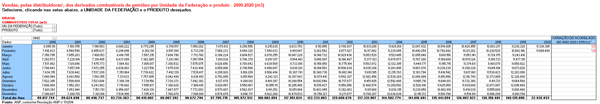

ANP Fuel Sales ETL Test
=======================

This test consists in developing an ETL pipeline to extract internal pivot caches from consolidated reports [made available](http://www.anp.gov.br/dados-estatisticos) by Brazilian government's regulatory agency for oil/fuels, *ANP (Agência Nacional do Petróleo, Gás Natural e Biocombustíveis)*.

**The raw file can be found [here](https://github.com/raizen-analytics/data-engineering-test/raw/master/assets/vendas-combustiveis-m3.xls).** 

## Goal

This `xls` file has some pivot tables like this one:

The developed pipeline is meant to extract and structure the underlying data of two of these tables:
- Sales of oil derivative fuels by UF and product
- Sales of diesel by UF and type

The totals of the extracted data must be equal to the totals of the pivot tables.

## Schema

Data should be stored in the following format:

| Column       | Type        |
| ------------ | ----------- |
| `year_month` | `date`      |
| `uf`         | `string`    |
| `product`    | `string`    |
| `unit`       | `string`    |
| `volume`     | `double`    |
| `created_at` | `timestamp` |

Remember to define a convenient partitioning or indexing schema.

## Closing Remarks

Use the tools and technologies of your choice - preferably in Python - and store the code in GitHub. Seize this opportunity to demonstrate your skills in some data pipeline orchestration framework and containerization technology! Also, remember to add steps to your pipeline to check whether the extracted data is consistent with the consolidated values on raw tables.

**Good luck!**
